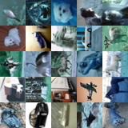
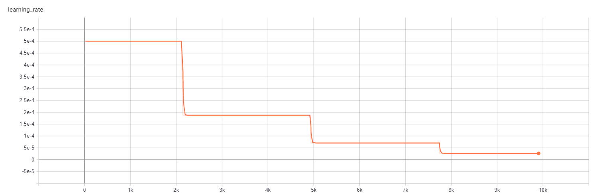
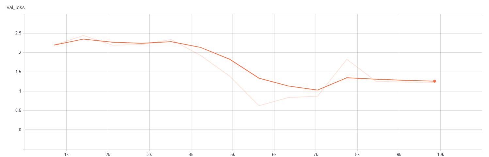
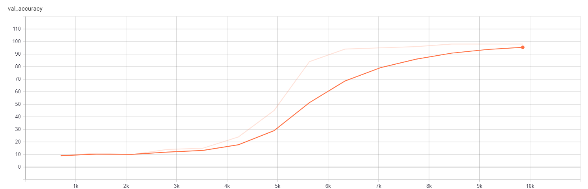

# Classification-PyTorch

Implementation of the ResNet architectures for image classification.
ResNet architectures that are implemented are: ResNet18, ResNet34,
ResNet50, ResNet101, ResNet152.

## Data
After splitting your dataset into training and validation part you need to create one json file for both train 
and val datasets. The content of the json file is list of images and labels. An example is written below.
```
[
  {
    "img_path": "/data/image_1.jpg",
    "label": 5
  },
  {
    "img_path": "/data/image_2.jpg",
    "label": 3
  }
]
```
Also, you have to provide class names as txt file with list of classes. Line number represents class id. 
An example is below.
```
class1
class2
class3
```

## Training
To start training run script train.py: ```python train.py --config config.yaml``` where ```config.yaml``` is 
config file with all parameters for training. Example of a config file is provided in the repo and it is 
displayed below.
```
Dataset:
  train_data_path: "./dataset/train_data.json"  # Path to json file with train data
  val_data_path: "./dataset/val_data.json"  # Path to json file with val data
  classes_path: "./dataset/classes.txt"  # Path to .txt file with list of classes
  num_classes: 5  # Number of classes
Train:
  lr_scheduler:
    lr_init: 0.001  # Initial learning rate
    lr_end: 0.0001  # Final learning rate
    StepDecay:
      use: True  # Use StepDecay as learning rate scheduler
      epoch_steps: [2, 4, 6]  # Epochs for decreasing leraning rate
  batch_size: 4  # Batch size
  epochs: 10  # Number of epochs
  eval_per_epoch: 5  # Number of evals on the validation data during an epoch
  image_size: [224, 224]  # Input image size. Divisible by 32. Minimum image size is [128,128]
  channels: 3  # Number of channels of the input image
  optimizer: "adam"  # Optimization algorithm. Supported: sgd | adam
  arch: "mobilenet_v1"  # Neural net architecture. Supporeted: resnet18 | resnet34 | resnet50 | resnet101 | resnet152 | mobilenet_v1 | mobilenet_v2
  pretrained: ""  # Path to pretrained weights
  device: 0  # GPU id
Augmentation:  # Augmentation methods. In each method value p is probability of using that method
  RandomCrop:
    p: 0.0
  RandomHorizontalFlip:
    p: 0.0
  RandomRotate:
    p: 0.0
    angle: 30
  RandomBrightness:
    p: 0.0
    low_value: 0.5
    high_value: 4.0

Logging:
  tb_logdir: "./train_logs/tb_logs"  # tensorboard log directory
  ckpt_dir: "./train_logs/checkpoints"  # directory for storing checkpoints
```
During one epoch ```eval_per_epoch``` checkpoints will be saved where ```eval_per_epoch``` is parameter in 
the config.

## Results

### CIFAR-10 Dataset

CIFAR-10 dataset consists of 60000 images where 50000 images are in train and 10000 images are in test 
part). Number of classes is 10 where classes are:
```
airplane
automobile
bird
cat
deer
dog
frog
horse
ship
truck
```
Several images from dataset are displayed below.



More details about dataset can be found [here](https://www.cs.toronto.edu/~kriz/cifar.html).

Train dataset is split into train and validation datasets where 45000 images are chosen for train and 
5000 images are chosen for validation dataset.

Network that is used is resnet34. Accuracy on validation dataset is 98% which means that network will 
correctly classify 98 out of 100 images from validation dataset.

After training the model is run on test dataset. Accuracy that is obtained on test set is 

Screenshots of the tensorboard with learning rate, loss on the train dataset and loss and accuracy on the 
validation dataset for this training are displayed below. 


*Learning rate*


*Train Loss*


*Val Loss*


*Val accuracy*

Training is run for 14 epochs with batch size = 64. Optimizer that is used is adam. Size of the input image 
to the model is 128x128. Size of the images in the dataset is 32x32. In order to train model with input size 
128x128 each image is padded from 32x32 to 128x128.
